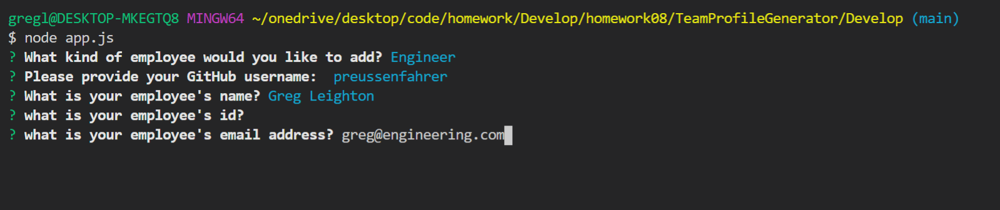

# TeamProfileGenerator

     
 ## Table of Contents 

- [Description](#Description)

- [Video Demo](###Video)

- [Installation and Usage](##Installation)

- [Credits](##Credits)

- [Licensing](###Licensing)

         
    
 ## Description:
TeamProfileGenerator (TPG) is CLI application where a user can generate an HTML page for a team of collaborators or members of a company. Working with node.js and inquirer, TPG will prompt the user in the command line with a series of questions, beginning with a list of options about what sort of team member they might want to add to their page. In this application, the user is offered the choice of an "intern", "manager", or "engineer", all of which run off of a parent "employee" object that holds the basic details that a webpage would have for an employee (email, id, office number). Based on the selection in the first prompt, the user can select various other categories, such as a the university attended by an intern, the github username of an engineer, or the office number of a manager. The end result is a smooth and functional application that is easy to use and quick. Also, the template `<html>` files are styled in bootstrap, so it is very easy to customize a variety of factors about the overall look of the page. 

### Video Demo:
https://drive.google.com/file/d/1rIiRRF7kt-noHYt8tZL9AGgaEqhdQtLS/view

 ## Installation and Usage:
                
To run TPG, clone this repository onto your machine. Then, install it into a file on your computer. TPG comes with gitignore so you don't have to install unnecessary items. Once you've got that going, open up your IDE (such as VS Code), and navigate to the application's folder. If you don't already have it, make sure you have `<Node.js>`, since TPG uses `<Node.js>`. Also, make sure to run an `npm i`, then install `inquirer` before you run the application. Check to make sure your `package.json` is installed to make sure this was all done successfully.

The images below go through the process of running TPG:
1.) We first begin with running `node app.js`:

2.) Then the user is prompted with what kind of employee that they want to add to their page. In the next images, you can see the functionality of how to select the information to generate an Engineer's page and an Intern's page 
 

 

 

Each time you go through a series of prompts, you will be given the option to add another employee or category in the form of a yes or no question. The following picture shows what this looks like when a user selects "no", and the three employees are displayed:

Once this happens, you will see a `team.html` document appear in the output folder, which will have your new information in a ready-to-go HTML file:

Here, you could add some bootstrap styling, or you could even do this in teh `template.html` documents provided for each class. The end result after you load your browser is shown here:

If you hire someone or add a new team member, the best part about TPG is that you're easily able to go through and generate it directly to your webpage, without having to navigate the HTML document.

 ## Credits:

For this application, I was helped immensely by my colleagues in the University of Pennsylvania LPS Coding bootcamp, especially Leif Hetland (https://github.com/leifehetland), and my tutor, Greg Considine (https://github.com/gconsidine). 

I also used the library for inquirer, available at the github page of Simon Boudrias (https://github.com/SBoudrias).

 ## Licensing:

MIT License

Permission is hereby granted, free of charge, to any person obtaining a copy of this software and associated documentation files (the "Software"), to deal in the Software without restriction, including without limitation the rights to use, copy, modify, merge, publish, distribute, sublicense, and/or sell copies of the Software, and to permit persons to whom the Software is furnished to do so, subject to the following conditions:

The above copyright notice and this permission notice shall be included in all copies or substantial portions of the Software.

THE SOFTWARE IS PROVIDED "AS IS", WITHOUT WARRANTY OF ANY KIND, EXPRESS OR IMPLIED, INCLUDING BUT NOT LIMITED TO THE WARRANTIES OF MERCHANTABILITY, FITNESS FOR A PARTICULAR PURPOSE AND NONINFRINGEMENT. IN NO EVENT SHALL THE AUTHORS OR COPYRIGHT HOLDERS BE LIABLE FOR ANY CLAIM, DAMAGES OR OTHER LIABILITY, WHETHER IN AN ACTION OF CONTRACT, TORT OR OTHERWISE, ARISING FROM, OUT OF OR IN CONNECTION WITH THE SOFTWARE OR THE USE OR OTHER DEALINGS IN THE SOFTWARE.
    
  
  